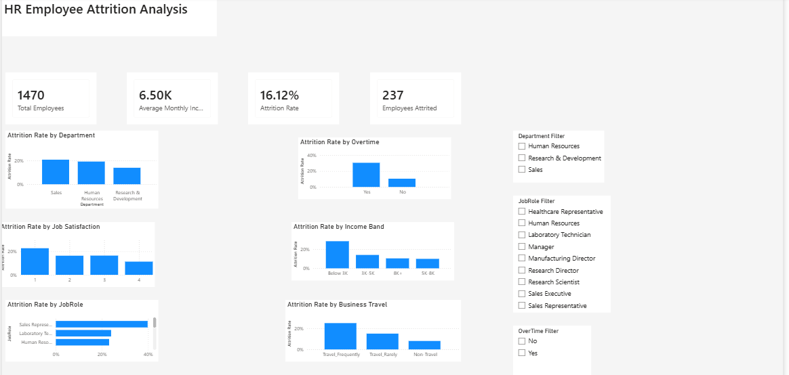

# HR Employee Attrition Analysis

##Project Overview

This project analyzes employee attrition using SQL and Power BI to identify key factors associated with employees leaving an organization.

The analysis focuses on department, job role, overtime, job satisfaction, income level, tenure, and business travel to identify employee groups with higher attrition rates.

##Tools Used

* **MySQL** — Data analysis and SQL queries
* **Power BI** — Interactive dashboard and data visualization
* **GitHub** — Project documentation and portfolio

##Project Files

* `HR_Employee_Attrition_Analysis.sql` — SQL queries used for data analysis
* `HR_Employee_Attrition_Analysis.pbix` — Power BI dashboard
* `HR_Employee_Attrition_Dashboard.png` — Dashboard screenshot

##Dataset

The dataset contains information about **1,470 employees** and includes attributes related to demographics, job roles, compensation, job satisfaction, overtime, business travel, tenure, and employee attrition.

##Key Metrics

| Metric             |  Value |
| ------------------ | -----: |
| Total Employees    |  1,470 |
| Employees Who Left |    237 |
| Attrition Rate     | 16.12% |

##Key Analysis

The project investigates:

* Attrition by department
* Attrition by job role
* Attrition by overtime
* Attrition by job satisfaction
* Attrition by income band
* Attrition by years at company
* Attrition by business travel

##Key Insights

* **Sales** had the highest department-level attrition rate at **20.63%**.
* **Sales Representatives** had the highest job-role attrition rate at **39.76%**.
* Employees working **overtime** had an attrition rate of **30.53%**, compared with **10.44%** for employees without overtime.
* Employees with low job satisfaction had a **23%** attrition rate, compared with **11%** among employees with the highest satisfaction.
* Employees earning below **3K monthly income** had a **28.61%** attrition rate.
* Employees with **0–2 years** at the company had a **30%** attrition rate, compared with **8%** among employees with 11+ years of tenure.
* Employees who travelled frequently for business had a **24.91%** attrition rate, compared with **8%** among non-travelling employees.

##Power BI Dashboard

The Power BI dashboard provides an interactive view of employee attrition through KPI cards, charts, and filters.

##Dashboard Preview

**Business Recommendations**

Based on the analysis, HR teams could investigate:

* Retention strategies for Sales and high-risk job roles
* Workload and overtime management
* Early-tenure employee onboarding and engagement
* Compensation and career-growth opportunities
* Employee satisfaction and workplace experience
* Work-life balance for frequent business travelers

**Conclusion**

This project demonstrates an end-to-end data analytics workflow, from SQL-based data analysis to Power BI dashboard development and business insight generation.

The analysis helps identify employee groups with higher attrition risk and highlights areas where HR teams can investigate potential retention opportunities.

