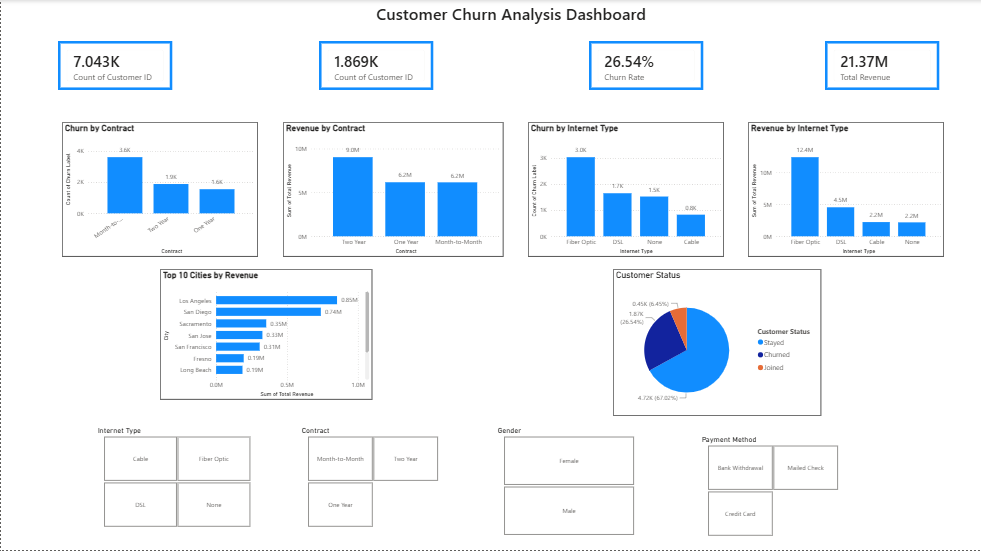

# Telco Customer Churn Analysis

## Project Overview

This project analyzes customer churn and revenue patterns for a telecommunications company using **MySQL and Microsoft Power BI**.

The analysis focuses on customer churn, contract types, internet services, payment methods, revenue contribution, customer status, churn reasons, and geographic revenue patterns.

The project follows an end-to-end data analytics workflow:

**SQL Analysis → Business Insights → Power BI Dashboard**

---

## Business Objective

The objective of this project is to understand customer churn and identify patterns that can help a telecom business improve customer retention and understand its revenue base.

The analysis answers questions such as:

- What is the overall customer churn rate?
- How does churn vary by contract type?
- How does churn vary by internet service?
- Which contract types generate the most revenue?
- Which internet service types generate the most revenue?
- Which cities generate the highest revenue?
- What are the major reasons customers leave?
- How are customers distributed by customer status?
- How do payment methods and customer demographics relate to the customer base?

---

## Dataset

The dataset contains **7,043 telecom customer records**.

The dataset includes customer information related to:

- Customer demographics
- Gender
- Location
- Contract type
- Internet type
- Payment method
- Customer status
- Churn label
- Churn category
- Churn reason
- Customer tenure
- Monthly charges
- Total revenue
- Customer lifetime value

---

## Tools & Technologies

| Tool | Purpose |
|---|---|
| MySQL | Data analysis and SQL queries |
| Power BI | Interactive dashboard and visualization |
| GitHub | Project documentation and portfolio |

---

## Key Performance Indicators

| KPI | Result |
|---|---:|
| Total Customers | 7,043 |
| Churned Customers | 1,869 |
| Churn Rate | 26.54% |
| Total Revenue | 21.37M |

---

## Key Insights

### Customer Churn

The analysis identified **1,869 churned customers** out of a total customer base of **7,043**, resulting in an overall churn rate of **26.54%**.

Customer status was distributed as:

- Stayed: **4,720**
- Churned: **1,869**
- Joined: **454**

---

### Churn by Contract

Contract type was analyzed to understand differences in customer churn behavior.

The dashboard compares:

- Month-to-Month
- One Year
- Two Year

Month-to-month customers represent the largest contract segment and are an important segment for churn analysis.

---

### Revenue by Contract

Total revenue by contract type:

| Contract | Revenue |
|---|---:|
| Two Year | 9.04M |
| One Year | 6.17M |
| Month-to-Month | 6.16M |

Two-year contracts contribute the highest total revenue among the three contract categories.

---

### Churn by Internet Type

The analysis compares churn across:

- Fiber Optic
- DSL
- Cable
- None

Fiber Optic represents the largest internet service category in the customer base.

---

### Revenue by Internet Type

| Internet Type | Revenue |
|---|---:|
| Fiber Optic | 12.41M |
| DSL | 4.55M |
| Cable | 2.23M |
| None | 2.19M |

Fiber Optic contributes the highest revenue among the internet service categories.

---

### Churn Reason

The most frequently recorded churn reason identified in the analysis was:

**Competitor had better devices — 313 customers**

This indicates that competitive offerings can be an important factor in customer churn and may require further investigation.

---

### Payment Method

The analysis also examined customer payment methods:

| Payment Method | Customers / Records |
|---|---:|
| Bank Withdrawal | 12,672,091.30 |
| Credit Card | 8,157,186.16 |
| Mailed Check | 541,854.23 |

These values represent the aggregated metric analyzed in the SQL query.

---

### Revenue by Location

California generated the highest revenue among the states analyzed:

**California — 21.37M**

Top revenue-generating cities included:

| City | Revenue |
|---|---:|
| Los Angeles | 852,725.23 |
| San Diego | 738,416.01 |
| Sacramento | 353,371.84 |
| San Jose | 326,478.36 |
| San Francisco | 306,995.99 |

---

## Power BI Dashboard

The Power BI dashboard provides an interactive view of customer churn and revenue performance.

### Dashboard Components

- Total Customers
- Churned Customers
- Churn Rate
- Total Revenue
- Churn by Contract
- Churn by Internet Type
- Revenue by Contract
- Revenue by Internet Type
- Top 10 Cities by Revenue
- Customer Status Distribution

### Interactive Filters

The dashboard includes slicers for:

- Contract
- Internet Type
- Gender
- Payment Method

These filters allow users to interactively explore the customer base and identify patterns across different segments.

---

## Dashboard Preview

---

## Project Files

### SQL Analysis

**Customer_Churn_Analysis.sql**

Contains the SQL queries used to analyze customer churn, contracts, internet services, revenue, payment methods, customer status, churn reasons, and geographic performance.

### Power BI Dashboard

**Telco_Customer_Churn_Analysis.pbix**

Contains the completed interactive Power BI dashboard with KPIs, charts, and slicers.

### Dashboard Screenshot

**Dashboardscreenshot.png**

A static preview of the completed Power BI dashboard.

---

## Skills Demonstrated

- SQL
- MySQL
- Data Analysis
- Data Exploration
- Data Aggregation
- Business Intelligence
- Power BI
- Data Visualization
- Dashboard Design
- KPI Development
- Interactive Filtering
- Business Insight Generation
- GitHub Documentation

---

## Conclusion

This project demonstrates an end-to-end approach to analyzing telecom customer data using SQL and Power BI.

The analysis identifies key churn patterns, revenue trends, customer segments, and potential retention areas while presenting the findings through an interactive business dashboard.

**Raw Data → SQL Analysis → Insights → Power BI Dashboard**
