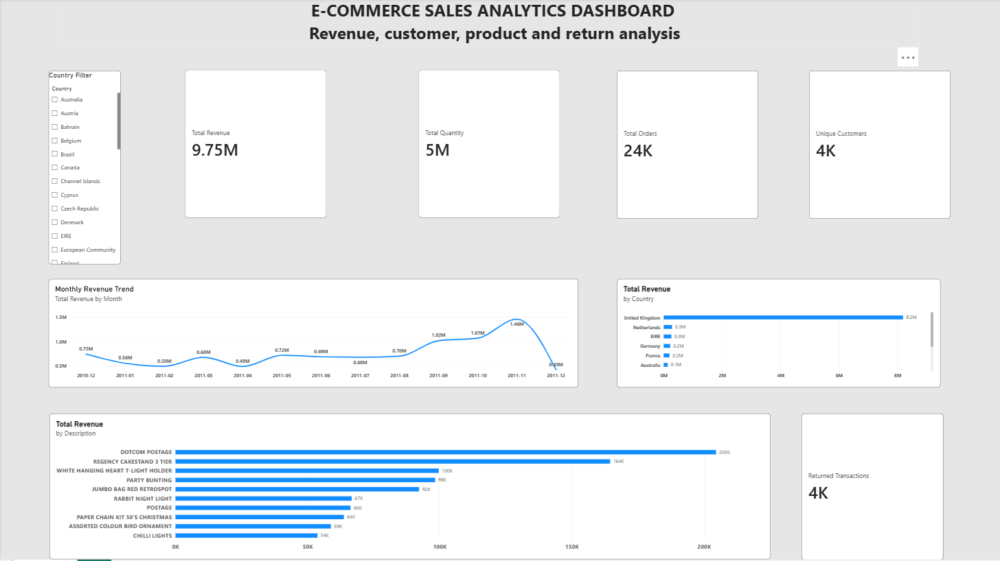

# E-Commerce Sales Analytics Dashboard

## Project Overview

This project analyzes an online retail dataset to identify revenue trends, top-performing countries and products, customer contribution, and returned transactions.

The project follows a complete data analytics workflow:

**Data Cleaning → MySQL → SQL Analysis → Power BI Dashboard**

## Tools Used

- MySQL
- SQL
- Power BI
- Excel/CSV

## Business Questions

- Which countries generate the highest revenue?
- How does revenue change month by month?
- Which products generate the highest revenue?
- Which customers contribute the most revenue?
- How many transactions and units were returned?

## SQL Analysis

SQL was used to analyze the cleaned retail dataset and generate:

- Top 10 countries by revenue
- Monthly revenue
- Top 10 products by revenue
- Returned transactions and returned units
- Top 10 customers by revenue

## Power BI Dashboard

The Power BI dashboard provides an interactive view of:

- Total Revenue
- Total Quantity
- Customer and transaction metrics
- Monthly revenue trends
- Top 10 countries by revenue
- Top 10 products by revenue
- Returned transactions
- Country-level filtering

## Key Insights

- The United Kingdom generated the highest revenue among the analyzed countries.
- Revenue increased significantly during September–November 2011, with November being the strongest month.
- Regency Cakestand 3 Tier was among the highest-revenue products after excluding non-product entries such as postage and manual transactions.
- Customer revenue was concentrated among a relatively small group of high-value customers.
- The dataset contains a significant number of returned transactions and returned units.

## Project Files

- `eCommerce_Sales_Analytics.pbix` — Power BI dashboard
- `eCommerce_Dashboard.png` — Dashboard screenshot
- `eCommerce_Analysis_Clean.sql` — Final SQL analysis queries

## Dashboard Preview

